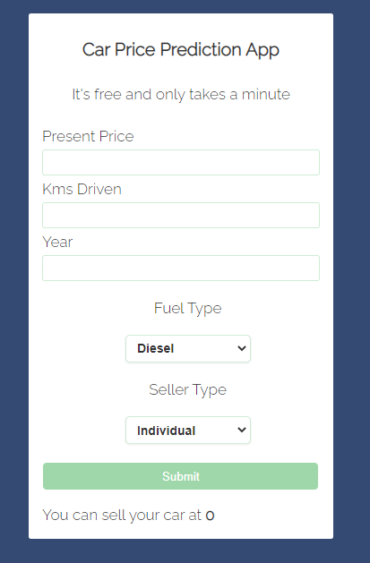

### 🚗Car Price Prediction Project
---

Link : https://car-price-pred-application.herokuapp.com/home

### 📄Description
---
In this project, our aim is to develope an End-to-End machine learning project that predicts the car price using multiple features like Peresent Price, Kms Driven, Year, Fuel Type and Seller Type.This project was a little bit challenging.This is because you have to take care of multiple outliers in the dataset that each of them can produce some negative effects on your model.Then in Feature Engineering part you have to convert multiple categorical features into encoded labels and at last in the Feature Selection part(by using some statistical tests like `chi2` and `ANOVA` it was revealed that some features did not have a strong relationship with the target feature. 

### 📐The Model
---
For this project, Random Forest Regressor is used. In spite of good results that this algorithm can produce, its creation and validation was a little bit challenging. This is because many hyperparameters have to be defined to Random Forest fit on them and this takes some time.After that Cross-Validation is applied and the best, worst, and mean accuracy is calculated.The more infos about the model's performance is availabe in the `Model_Creation_&_Validation` in the `scripts` folder.
The model is saved by pickle format and you can access it by `model` folder.

### 🎫 Datasets
---
